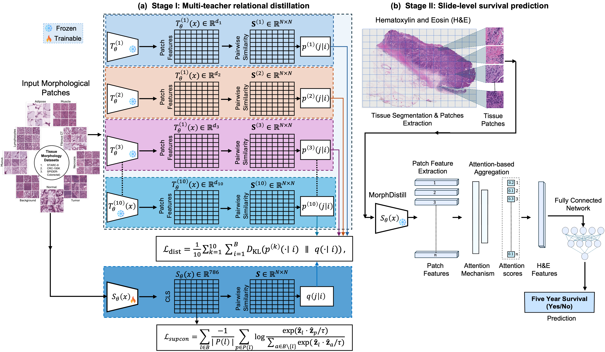
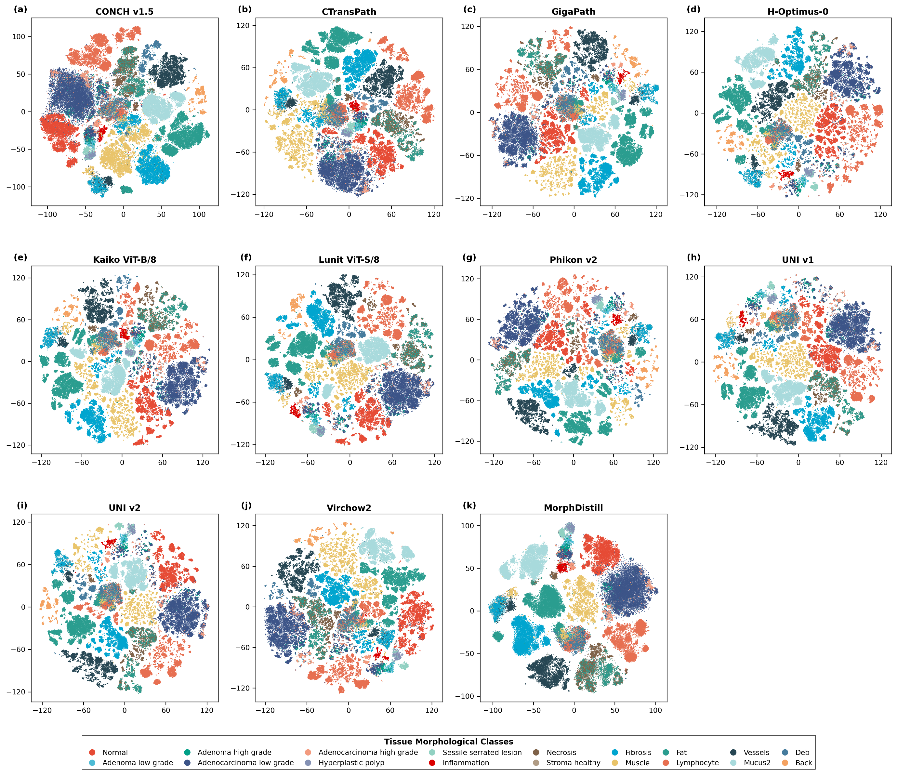
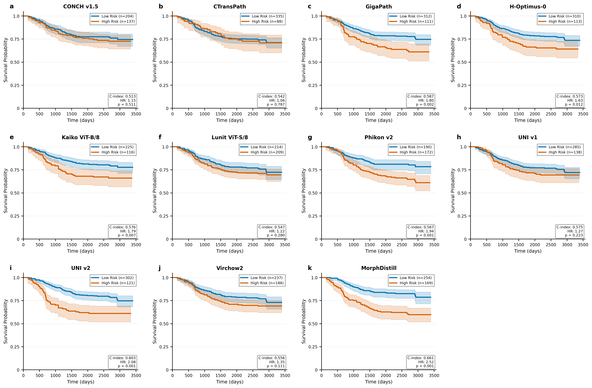
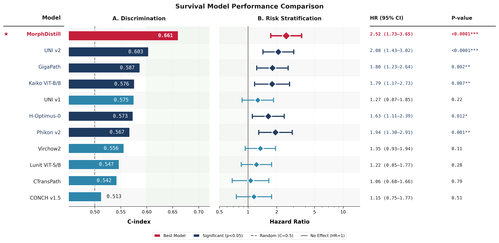
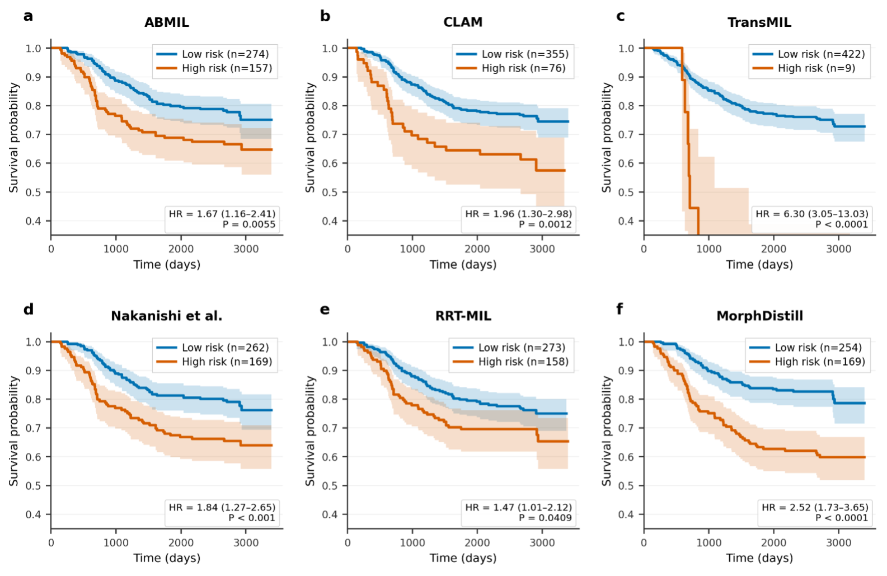
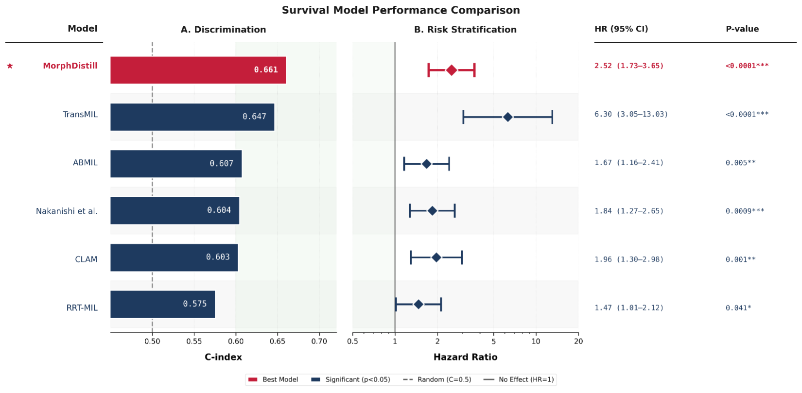
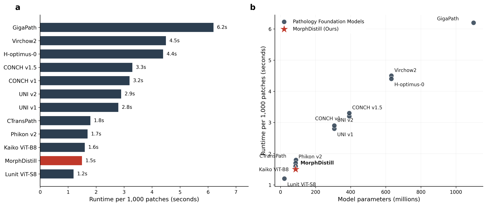
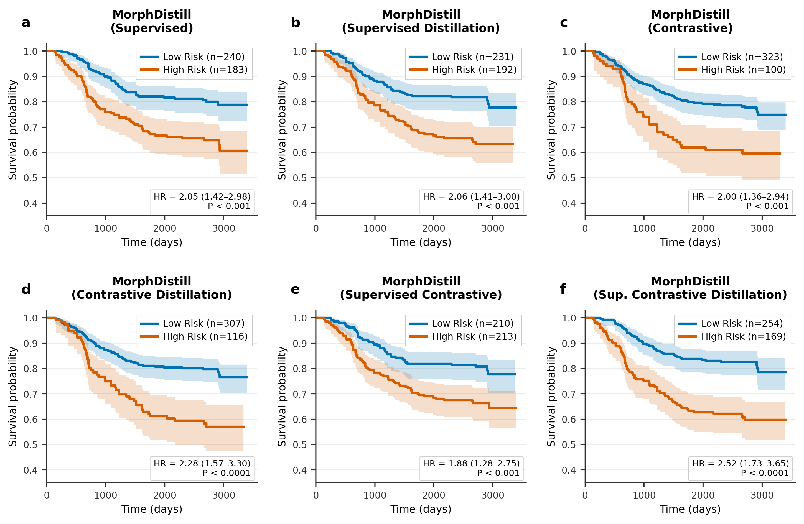
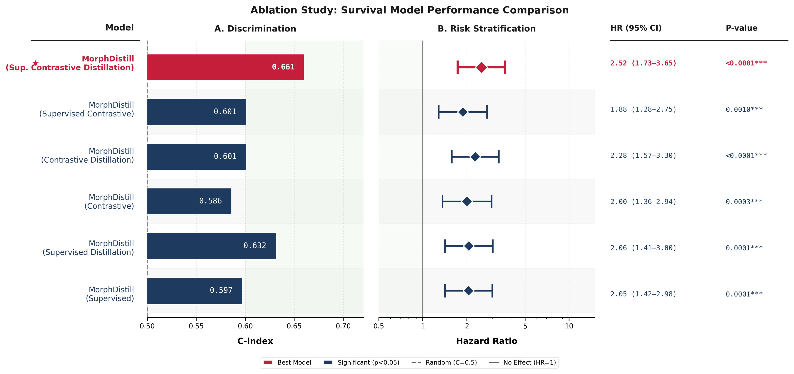

# MorphDistill: Distilling Unified Morphological Knowledge from Pathology Foundation Models for Colorectal Cancer Survival Prediction

<p align="center">
  
  
  
  
</p>

<p align="center">
  <b>Hikmat Khan, Usama Sajjad, Metin N. Gurcan, Anil Parwani, Wendy L. Frankel, Wei Chen, Muhammad Khalid Khan Niazi</b><br>
  Department of Pathology, College of Medicine, The Ohio State University Wexner Medical Center<br>
  Center for Artificial Intelligence Research, Wake Forest University School of Medicine
</p>

<p align="center">
  <a href="mailto:Hikmat.khan@osumc.edu">📧 Contact</a> •
  <a href="#citation">📄 Citation</a> •
  <a href="#installation">⚙️ Installation</a> •
  <a href="#usage">🚀 Usage</a>
</p>

---

## 📌 Overview

**MorphDistill** is a two-stage framework that unifies complementary morphological knowledge from **10 state-of-the-art pathology foundation models** into a single compact, CRC-specific encoder for five-year colorectal cancer survival prediction.

The key insight: no single foundation model captures the full spectrum of prognostically relevant morphological information. MorphDistill addresses this by distilling relational knowledge from multiple heterogeneous teachers — without requiring explicit feature projection — into one specialized student encoder.

---

## 🏆 Highlights

| Metric | MorphDistill | Best Baseline (UNI v2) | Improvement |
|--------|-------------|------------------------|-------------|
| AUC (Alliance cohort) | **0.68 ± 0.08** | 0.63 ± 0.03 | ~8% relative |
| C-index (Alliance cohort) | **0.661** | 0.633 | — |
| Hazard Ratio | **2.52** (95% CI: 1.73–3.65) | 2.08 (95% CI: 1.43–3.02) | — |
| C-index (TCGA external) | **0.6151** | 0.6034 (ABMIL) | — |
| Inference speed | **1.5s / 1K patches** | 3.06s avg | **2× faster** |
| Model size | **86M params** | Up to 1.1B (GigaPath) | Much smaller |

- ✅ Outperforms **10 foundation model baselines** (CONCH v1.5, CTransPath, GigaPath, Hoptimus0, Kaiko-ViTB8, Lunit-ViTS8, Phikon v2, UNI v1, UNI v2, Virchow2)
- ✅ Outperforms **5 MIL aggregation baselines** (ABMIL, CLAM, TransMIL, Nakanishi et al., RRT-MIL)
- ✅ Validated on **independent TCGA-COAD/READ** cohort (n=562)
- ✅ Robust across **treatment regimens, sex, and tumor locations**

---

## 📐 Method

### Framework Overview

<p align="center">
  
</p>

> **Figure 1:** Schematic overview of the MorphDistill framework. **(A) Stage I** — A student encoder learns CRC-specific morphological representations by distilling knowledge from ten pretrained pathology foundation models via dimension-agnostic similarity alignment and supervised contrastive regularization. **(B) Stage II** — The frozen MorphDistill encoder extracts patch embeddings from WSIs, which are aggregated using attention-based multiple instance learning (ABMIL) to generate slide-level representations for five-year survival classification.

---

### Stage I — Multi-Teacher Relational Distillation

A student encoder (ViT-B/16) is trained on large-scale CRC patch datasets using two complementary objectives:

**1. Dimension-Agnostic Relational Alignment**

Rather than aligning feature vectors directly (which requires matching embedding dimensions), MorphDistill aligns *batch-wise pairwise similarity matrices*. For each teacher *k*, a softmax-normalized relational distribution is computed over cosine similarities, and the student is trained to match it via KL divergence:

$$\mathcal{L}_\text{dist} = \frac{1}{K}\sum_{k=1}^{K}\sum_{i=1}^{B} D_\text{KL}\left(p^{(k)}(\cdot|i) \,\|\, q(\cdot|i)\right)$$

This makes knowledge transfer **architecture-agnostic** — teachers with embedding sizes ranging from 384 to 1536 dimensions can all contribute simultaneously.

**2. Supervised Contrastive Regularization**

To ground the distilled representation in CRC-specific tissue semantics:

$$\mathcal{L}_\text{supcon} = \sum_{l \in B} \frac{-1}{|P(l)|}\sum_{p \in P(l)} \log \frac{\exp(\hat{\mathbf{z}}_l \cdot \hat{\mathbf{z}}_p / \tau)}{\sum_{a \in B \setminus \{l\}} \exp(\hat{\mathbf{z}}_l \cdot \hat{\mathbf{z}}_a / \tau)}$$

**Combined Objective:**

$$\mathcal{L}_\text{total} = \lambda \mathcal{L}_\text{supcon} + (1 - \lambda)\mathcal{L}_\text{dist}, \quad \lambda = 0.75$$

### Stage II — Slide-Level Survival Prediction

The frozen MorphDistill encoder extracts 768-dim patch embeddings from tessellated WSIs. These are aggregated via **Attention-Based Multiple Instance Learning (ABMIL)** into a slide-level representation, then classified as 5-year survivor / non-survivor using binary cross-entropy.

---

## 📂 Datasets

### Stage I Pre-training

| Dataset | Classes | Training Patches | Validation Patches |
|---------|---------|------------------|--------------------|
| CRC-100K | 9 | 100,000 | 7,180 |
| STARC-9 | 9 | 630,000 | 92,000 |
| SPIDER-Colorectal | 13 | 61,743 | 15,479 |
| **Combined** | **18** | **791,743** | **114,659** |

### Stage II Survival Cohorts

| Cohort | Patients | WSIs | Deceased (5yr) | Surviving |
|--------|----------|------|----------------|-----------|
| Alliance/CALGB 89803 (primary) | 424 | 431 | 103 | 321 |
| TCGA-COAD/READ (external validation) | 562 | 562 | 117 | 445 |

---

## ⚙️ Installation

```bash
# Clone the repository
git clone https://github.com.mcas.ms/hikmatkhan/MorphDistill.git
cd MorphDistill

# Create conda environment
conda create -n morphdistill python=3.9
conda activate morphdistill

# Install dependencies
pip install -r requirements.txt
```

### Requirements

```
torch>=2.0.0
torchvision>=0.15.0
timm>=0.9.0
numpy
pandas
scikit-learn
lifelines
openslide-python
Pillow
tqdm
wandb  # optional, for logging
```

---

## 🚀 Usage

### Stage I: Train the MorphDistill Encoder

```bash
python train_stage1.py \
  --data_root /path/to/patch/datasets \
  --teacher_models conch_v1.5 ctranspath gigapath hoptimus0 kaiko_vitb8 \
                   lunit_vits8 phikon_v2 uni_v1 uni_v2 virchow2 \
  --epochs 50 \
  --batch_size 256 \
  --lr 1e-3 \
  --weight_decay 1e-4 \
  --temperature 0.1 \
  --lambda_weight 0.75 \
  --output_dir ./checkpoints/stage1
```

### Stage II: Extract WSI Features

```bash
python extract_features.py \
  --wsi_dir /path/to/wsi/slides \
  --checkpoint ./checkpoints/stage1/best_encoder.pth \
  --output_dir ./features \
  --patch_size 224 \
  --magnification 20x \
  --tissue_threshold 0.25
```

### Stage II: Train Survival Predictor

```bash
python train_stage2.py \
  --feature_dir ./features \
  --survival_csv /path/to/survival_labels.csv \
  --aggregator abmil \
  --hidden_dim 512 \
  --epochs 100 \
  --lr 2e-4 \
  --l1_lambda 5e-4 \
  --n_folds 5 \
  --output_dir ./checkpoints/stage2
```

### Inference on New WSIs

```bash
python predict.py \
  --wsi_path /path/to/slide.svs \
  --encoder_checkpoint ./checkpoints/stage1/best_encoder.pth \
  --aggregator_checkpoint ./checkpoints/stage2/best_model.pth \
  --output results.json
```

---

## 📊 Results

### Representational Diversity Across Foundation Models

<p align="center">
  
</p>

> **Figure 2:** t-SNE visualization of patch embeddings across ten pathology foundation models and MorphDistill. Each point represents a tissue patch colored by morphological class. MorphDistill and UNI v2 exhibit more cohesive, well-separated clusters, indicating stronger discriminative capacity. The observed diversity across encoders confirms that different foundation models capture complementary aspects of tissue morphology, motivating our multi-teacher distillation approach.

---

### Encoder Benchmarking (Alliance Cohort, 5-fold CV)

| Encoder | AUC | Balanced Acc (%) | Sensitivity (%) | Specificity (%) |
|---------|-----|-----------------|-----------------|-----------------|
| CONCH v1.5 | 0.51 ± 0.07 | 50.81 | 41.80 | 59.81 |
| CTransPath | 0.58 ± 0.02 | 50.63 | 21.90 | 79.36 |
| GigaPath | 0.60 ± 0.04 | 56.37 | 35.86 | 76.89 |
| Hoptimus0 | 0.61 ± 0.04 | 56.59 | 36.71 | 76.46 |
| Kaiko-ViTB8 | 0.59 ± 0.11 | 58.38 | 46.45 | 70.31 |
| Lunit-ViTS8 | 0.58 ± 0.04 | 53.22 | 54.24 | 52.21 |
| Phikon v2 | 0.58 ± 0.04 | 58.05 | 59.50 | 56.61 |
| UNI v1 | 0.62 ± 0.05 | 53.58 | 38.14 | 69.02 |
| UNI v2 | 0.63 ± 0.03 | 60.59 | 44.62 | 76.53 |
| Virchow2 | 0.58 ± 0.02 | 55.73 | 52.71 | 58.75 |
| **MorphDistill (Ours)** | **0.68 ± 0.08** | **64.11** | **60.24** | 66.57 |

### Risk Stratification — Kaplan-Meier Curves (Encoders)

<p align="center">
  
</p>

> **Figure 3:** Kaplan-Meier survival curves for risk stratification across all encoder baselines and MorphDistill. Patients are stratified into high-risk and low-risk groups based on model prediction scores. MorphDistill maintains the most consistent and pronounced separation between the two groups throughout the five-year follow-up period.

### C-index and Hazard Ratio — Encoders

<p align="center">
  
</p>

> **Figure 4:** Time-to-event metrics for all foundation encoders. **(A)** Concordance index (C-index) and **(B)** Hazard Ratio with 95% confidence intervals. MorphDistill achieves the highest C-index (0.661) and hazard ratio (2.52, 95% CI: 1.73–3.65), outperforming all ten foundation model baselines.

---

### MIL Aggregation Comparison (MorphDistill features vs. UNI v2)

| Model | AUC | C-Index |
|-------|-----|---------|
| ABMIL + UNI v2 | 0.63 ± 0.06 | 0.607 |
| CLAM + UNI v2 | 0.66 ± 0.06 | 0.603 |
| TransMIL + UNI v2 | 0.67 ± 0.05 | 0.647 |
| RRT-MIL + UNI v2 | 0.59 ± 0.05 | 0.575 |
| **MorphDistill** | **0.68 ± 0.08** | **0.661** |

### Risk Stratification — Kaplan-Meier Curves (MIL Methods)

<p align="center">
  
</p>

> **Figure 5:** Comparison of risk stratification using MorphDistill and UNI v2 features across five MIL aggregation frameworks. MorphDistill consistently achieves better separation between high- and low-risk groups, with the most pronounced stratification observed when combined with ABMIL.

### C-index and Hazard Ratio — MIL Methods

<p align="center">
  
</p>

> **Figure 6:** C-index **(A)** and Hazard Ratio with 95% CI **(B)** for five MIL methods using MorphDistill and UNI v2 features. MorphDistill embeddings achieve higher C-index values and hazard ratios across all aggregation methods, confirming that performance improvements are attributable to the unified representation rather than the choice of MIL architecture.

---

### External Validation — TCGA COAD/READ (n=562)

| Method | C-Index |
|--------|---------|
| DSMIL | 0.5000 ± 0.01 |
| PANTHER | 0.5832 ± 0.07 |
| RRT-MIL | 0.5991 ± 0.08 |
| ABMIL | 0.6034 ± 0.05 |
| **MorphDistill** | **0.6151 ± 0.07** |

---

## ⚡ Computational Efficiency

<p align="center">
  
</p>

> **Figure 7:** Runtime efficiency of MorphDistill compared to pathology foundation models. **(a)** Feature extraction runtime per 1,000 patches. **(b)** Model size versus runtime. MorphDistill achieves efficient inference (1.5s per 1,000 patches) with a compact 86M parameter architecture, running 2× faster than the average foundation model.

| Model | Params (M) | Embed Dim | Runtime (s/1K patches) | Speedup vs Avg |
|-------|-----------|-----------|------------------------|----------------|
| Lunit-ViTS8 | 22 | 384 | 1.2 | 2.55× |
| **MorphDistill** | **86** | **768** | **1.5** | **2.04×** |
| Phikon v2 | 86 | 768 | 1.7 | 1.80× |
| UNI v2 | 307 | 1,024 | 2.9 | 1.05× |
| H-optimus-0 | 632 | 1,280 | 4.4 | 0.69× |
| GigaPath | 1,100 | 1,536 | 6.2 | 0.49× |

---

## 🔬 Ablation Study

### Impact of Training Strategy

<p align="center">
  
</p>

> **Figure 8:** Kaplan–Meier survival curves for the MorphDistill ablation study evaluating different Stage I representation learning strategies. The supervised contrastive distillation configuration (MorphDistill) yields the strongest survival stratification (HR = 2.52, 95% CI: 1.73–3.65, p < 0.0001).

<p align="center">
  
</p>

> **Figure 9:** Performance comparison of MorphDistill ablation configurations. **(A)** Concordance index and **(B)** Hazard Ratio with 95% confidence intervals. The supervised contrastive distillation configuration (MorphDistill, highlighted) achieves the highest C-index of 0.661 and HR of 2.52. Models incorporating knowledge distillation consistently demonstrate improved survival discrimination.

| Training Strategy | Distillation | AUC | C-Index | HR |
|-------------------|:-----------:|-----|---------|-----|
| Supervised | ✗ | 0.60 ± 0.07 | 0.597 | 2.05 |
| Supervised | ✓ | 0.64 ± 0.05 | 0.632 | 2.06 |
| Contrastive | ✗ | 0.62 ± 0.02 | 0.586 | 2.00 |
| Contrastive | ✓ | 0.63 ± 0.07 | 0.601 | 2.28 |
| Sup. Contrastive | ✗ | 0.62 ± 0.09 | 0.601 | 1.88 |
| **Sup. Contrastive (MorphDistill)** | **✓** | **0.68 ± 0.08** | **0.661** | **2.52** |

---

## 📁 Repository Structure

```
MorphDistill/
├── assets/                        ← Place all figure PNGs here
│   ├── framework.png              ← Figure 1  (main framework diagram)
│   ├── tsne.png                   ← Figure 2  (t-SNE visualization)
│   ├── kaplan_meier_enc.png       ← Figure 3  (KM curves - encoders)
│   ├── cindex_hr_enc.png          ← Figure 4  (C-index & HR - encoders)
│   ├── kaplan_meier_mil.png       ← Figure 5  (KM curves - MIL methods)
│   ├── cindex_hr_mil.png          ← Figure 6  (C-index & HR - MIL methods)
│   ├── runtime.png                ← Figure 7  (runtime efficiency)
│   ├── ablation_km.png            ← Figure 8  (ablation KM curves)
│   └── ablation_perf.png          ← Figure 9  (ablation C-index & HR)
├── configs/
│   ├── stage1_config.yaml
│   └── stage2_config.yaml
├── data/
│   ├── datasets.py
│   └── transforms.py
├── models/
│   ├── student_encoder.py
│   ├── teachers.py
│   ├── abmil.py
│   └── survival_head.py
├── losses/
│   ├── relational_distill.py
│   └── supcon.py
├── train_stage1.py
├── train_stage2.py
├── extract_features.py
├── predict.py
├── evaluate.py
├── requirements.txt
└── README.md
```

---

## 🏥 Clinical Significance

MorphDistill achieves a hazard ratio of **2.52** (p < 0.0001), meaning patients flagged as high-risk have more than **twice the 5-year mortality risk** of low-risk patients. The model demonstrates stable performance across:

- **Treatment regimens**: FL (AUC 0.70) and IFL (AUC 0.65)
- **Sex subgroups**: Female (AUC 0.65) and Male (AUC 0.69)
- **Tumor locations**: Cecum through sigmoid colon (AUC 0.63–0.83)

---

## 📄 Data and Code Availability

The MorphDistill source code, including Stage I encoder training, Stage II survival prediction, and feature extraction pipelines, is publicly available at https://github.com.mcas.ms/hikmatkhan/MorphDistill. The patch-level pre-training datasets used in Stage I — CRC-100K, STARC-9, and SPIDER-Colorectal — are publicly accessible through their respective original publications. The Alliance/CALGB 89803 whole-slide images and associated clinical outcomes used for Stage II survival prediction are available to qualified investigators through the Alliance for Clinical Trials in Oncology upon reasonable request and in accordance with institutional data sharing agreements. The external validation cohort from The Cancer Genome Atlas (TCGA-COAD and TCGA-READ) is publicly available via the GDC Data Portal (https://portal.gdc.cancer.gov/). For further inquiries regarding data access, code usage, or reproducibility, please contact the corresponding author at Hikmat.khan@osumc.edu or Hikmat.khan179@gmail.com.

---

## 📝 Citation

If you find this work useful, please cite:

```bibtex
@article{khan2025morphdistill,
  title     = {MorphDistill: Distilling Unified Morphological Knowledge from Pathology 
               Foundation Models for Colorectal Cancer Survival Prediction},
  author    = {Khan, Hikmat and Sajjad, Usama and Gurcan, Metin N. and Parwani, Anil 
               and Frankel, Wendy L. and Chen, Wei and Niazi, Muhammad Khalid Khan},
  journal   = {arXiv preprint},
  year      = {2025},
  note      = {Department of Pathology, The Ohio State University Wexner Medical Center}
}
```

---

## 🙏 Acknowledgements

- Dr. Fang-Shu Ou and the Alliance Statistics and Data Management Center for data acquisition
- Ohio Supercomputer Center for high-performance computing resources
- Department of Pathology and the Comprehensive Cancer Center at The Ohio State University

**Funding:** Supported by R01 CA276301 from the National Cancer Institute and Pelotonia under IRP CC13702 at The Ohio State University.

**Clinical Trial:** NCT00003835 (CALGB 89803)

---

## 📜 License

This project is licensed under the MIT License — see the [LICENSE](LICENSE) file for details.

> The CALGB 89803 data were obtained from the Alliance for Clinical Trials in Oncology. All analyses and conclusions are the sole responsibility of the authors and do not reflect the views of the clinical trial investigators, the NCTN, NCORP, or NCI.
