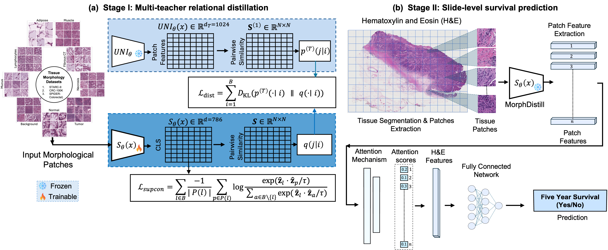
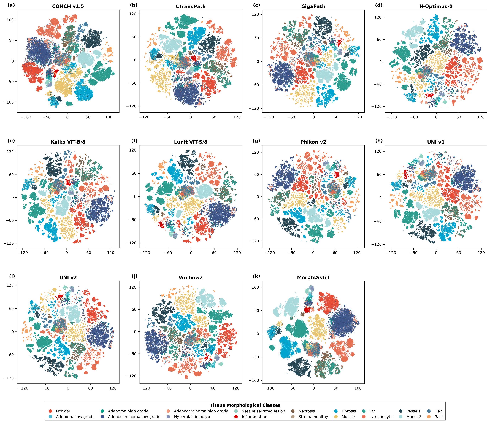
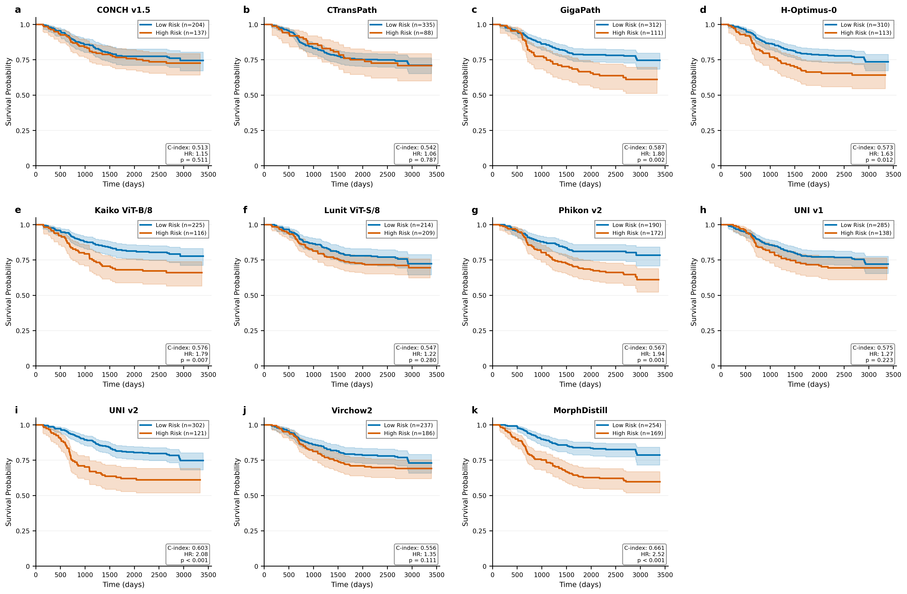
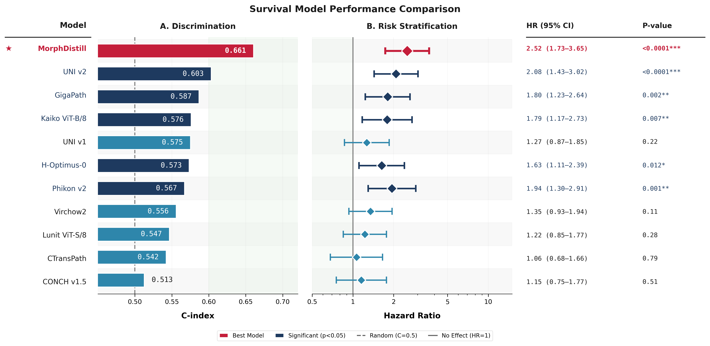
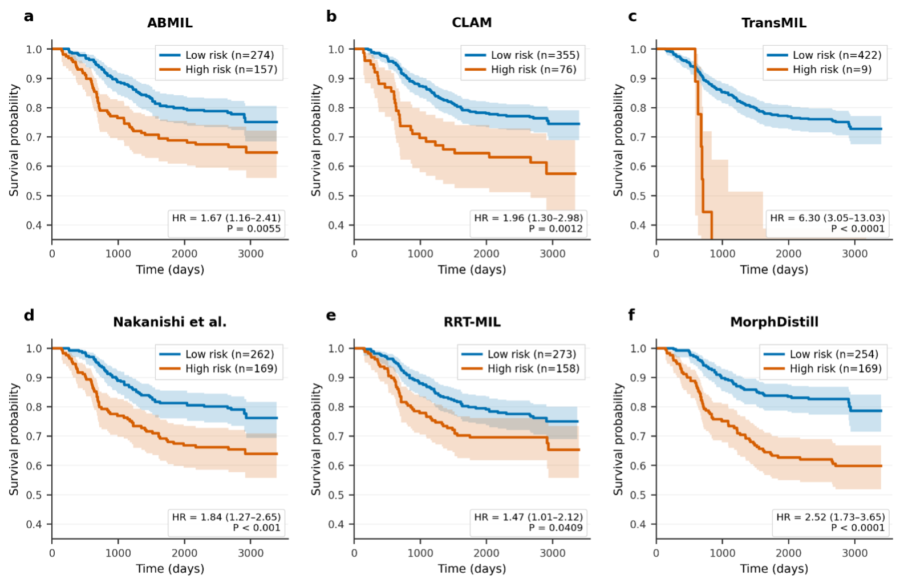
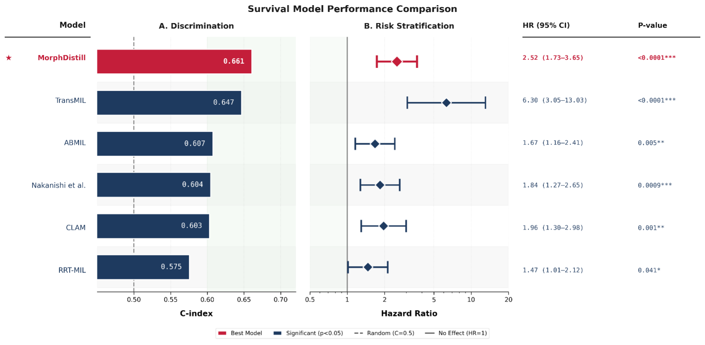
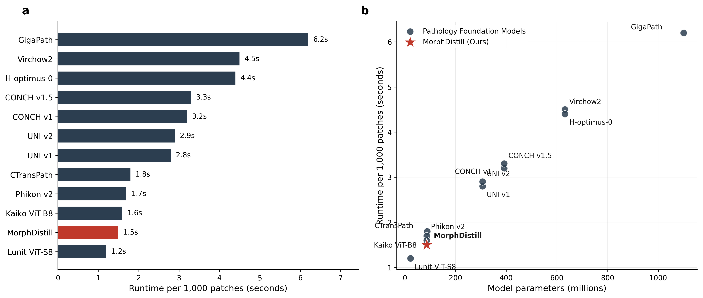
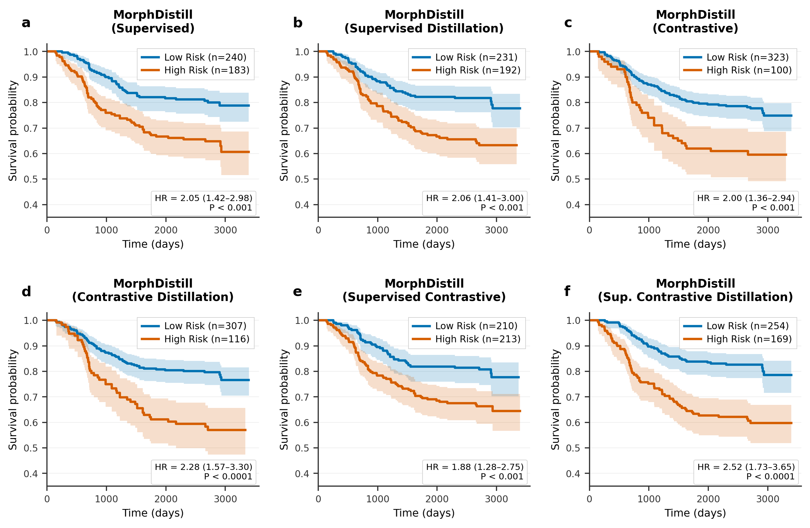
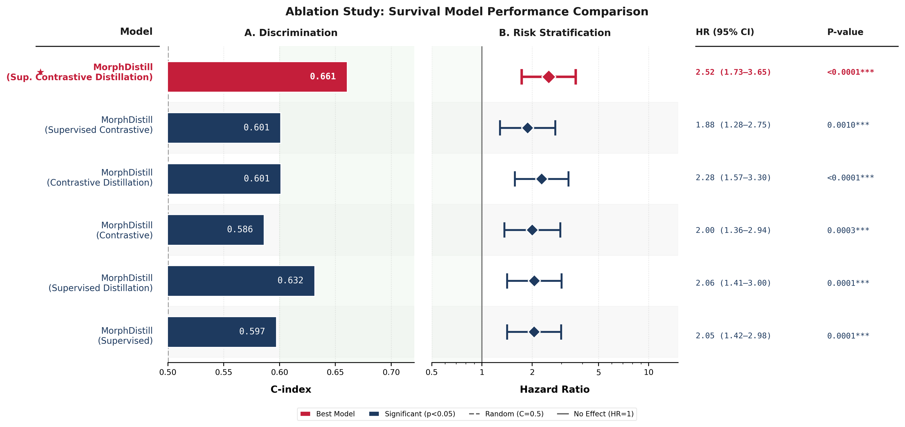

# MorphDistill

**Distilling Task-Specific Morphological Knowledge from a Pathology Foundation Model for Colorectal Cancer Survival Prediction — A Study Using a Multi-Center Clinical Trial Cohort**

<p align="center">
  
  
  
  
</p>

<p align="center">
  <b>Hikmat Khan, Usama Sajjad, Metin N. Gurcan, Anil Parwani, Wendy L. Frankel, Wei Chen, Muhammad Khalid Khan Niazi</b><br>
  Department of Pathology, College of Medicine, The Ohio State University Wexner Medical Center<br>
  Center for Artificial Intelligence Research, Wake Forest University School of Medicine
</p>

<p align="center">
  <a href="mailto:Hikmat.khan@osumc.edu">📧 Contact</a> •
  <a href="#-citation">📄 Citation</a> •
  <a href="#️-installation">⚙️ Installation</a> •
  <a href="#-usage">🚀 Usage</a>
</p>

---

> ### 📢 Status
> **The main paper describing this work is currently under review.**
> **The full source code, training scripts, and trained model weights will be released in this repository as soon as the paper is accepted.**

---

## 📌 Overview

**MorphDistill** is a two-stage framework that specializes a single pathology foundation model — **UNI v2** — into a compact, CRC-specific encoder for five-year colorectal cancer survival prediction.

The key insight: the prognostically relevant structure is already present in a general-purpose encoder, but it is organized for breadth across organs rather than for colorectal prognosis. MorphDistill transfers that structure into a smaller student and concurrently reorganizes it around colorectal tissue morphology. The result is a student encoder that is **more prognostic than the teacher it was derived from**, at under a third of the parameters.

Distillation is applied to **batch-wise similarity structure** rather than to feature vectors, so a 1,024-dimensional teacher can supervise a 768-dimensional student with no learned projection layer in between.

UNI v2 was selected as the teacher because it was the strongest of ten benchmarked foundation models on this task; the other nine appear in this repository as **baselines**, not as teachers.

---

## 🏆 Key Results

| Metric | MorphDistill | UNI v2 (teacher) | Improvement |
|--------|-------------|------------------|-------------|
| AUC (Alliance cohort) | **0.68 ± 0.08** | 0.63 ± 0.03 | ~8% relative |
| C-index (Alliance cohort) | **0.661** | 0.633 | +0.028 |
| Hazard ratio | **2.52** (95% CI 1.73–3.65) | 2.08 (95% CI 1.43–3.02) | — |
| C-index (TCGA external) | **0.615 ± 0.070** | 0.603 ± 0.050 (ABMIL) | +0.012 |
| Inference speed | **1.5 s / 1K patches** | 2.9 s / 1K patches | **1.93× faster** |
| Model size | **86M params** | 307M params | under a third |

- ✅ Highest AUC among **10 pathology foundation model baselines** (CONCH v1.5, CTransPath, GigaPath, H-optimus-0, Kaiko ViT-B/8, Lunit ViT-S/8, Phikon v2, UNI v1, UNI v2, Virchow2)
- ✅ Highest AUC and C-index among **6 MIL aggregation baselines** on the Alliance cohort (ABMIL, CLAM, TransMIL, Nakanishi et al., RRT-MIL, PROGPATH)
- ✅ Validated on an **independent TCGA-COAD/READ** cohort (n = 562)
- ✅ Stable across **treatment arm and sex**, with no systematic failure at any tumor subsite
- ✅ **2.04× faster** than the mean foundation model runtime (3.06 s / 1K patches)

---

## 📐 Method

### Framework Overview

<p align="center">
  
</p>

> **Figure 1:** Overview of the MorphDistill framework. **(A) Stage I** — a student encoder is trained on annotated colorectal patches under two objectives: dimension-agnostic similarity alignment, which transfers the inter-sample relational structure of the frozen UNI v2 teacher without feature projection, and supervised contrastive regularization, which grounds the representation in colorectal tissue morphology. **(B) Stage II** — the frozen MorphDistill encoder extracts patch embeddings from WSIs, which ABMIL aggregates into slide-level representations for five-year survival classification.

---

### Stage I — Relational Distillation from a Pathology Foundation Model

A ViT-B/16 student is trained on large-scale CRC patch datasets under two complementary objectives.

**1. Dimension-agnostic relational alignment**

Rather than aligning feature vectors directly (which requires matching embedding dimensions), MorphDistill aligns *batch-wise pairwise similarity matrices*. A softmax-normalized relational distribution is computed over cosine similarities for the teacher and the student, and the student is trained to match the teacher via KL divergence:

$$\mathcal{L}_\text{dist} = \sum_{i=1}^{B} D_\text{KL}\left(p^{(T)}(\cdot \mid i) \,\|\, q(\cdot \mid i)\right)$$

Because both similarity matrices are $B \times B$, the objective depends only on the batch size and not on the embedding dimensionalities. Knowledge therefore transfers from the 1,024-dimensional UNI v2 teacher to the 768-dimensional student **without any projection layer**, and the same procedure would work for a teacher of any output width.

**2. Supervised contrastive regularization**

To ground the distilled representation in CRC-specific tissue semantics across 18 morphological classes:

$$\mathcal{L}_\text{supcon} = \sum_{l \in B} \frac{-1}{|P(l)|}\sum_{p \in P(l)} \log \frac{\exp(\hat{\mathbf{z}}_l \cdot \hat{\mathbf{z}}_p / \tau)}{\sum_{a \in B \setminus \{l\}} \exp(\hat{\mathbf{z}}_l \cdot \hat{\mathbf{z}}_a / \tau)}$$

**Combined objective:**

$$\mathcal{L}_\text{total} = \lambda \mathcal{L}_\text{supcon} + (1 - \lambda)\mathcal{L}_\text{dist}, \quad \lambda = 0.75, \quad \tau = 0.1$$

### Stage II — Slide-Level Survival Prediction

The frozen MorphDistill encoder extracts 768-dimensional patch embeddings from tessellated WSIs (224 × 224 at 20×, patches with < 25% tissue discarded). These are aggregated via **attention-based multiple instance learning (ABMIL)** into a slide-level representation and classified as five-year survivor / non-survivor with binary cross-entropy.

---

## 📂 Datasets

### Stage I pre-training

| Dataset | Classes | Training patches | Validation patches |
|---------|---------|------------------|--------------------|
| CRC-100K | 9 | 100,000 | 7,180 |
| STARC-9 | 9 | 630,000 | 92,000 |
| SPIDER-Colorectal | 13 | 61,743 | 15,479 |
| **Combined (unified label set)** | **18** | **791,743** | **114,659** |

Source classes denoting the same morphology are pooled into a unified 18-class label set; each source class contributes to exactly one merged class, except the ungraded tumor-epithelium classes of CRC-100K and STARC-9, which are divided evenly between the two adenocarcinoma classes.

### Stage II survival cohorts

| Cohort | Patients | WSIs | Deceased (5 yr) | Surviving |
|--------|----------|------|-----------------|-----------|
| Alliance/CALGB 89803 (primary, stage III) | 424 | 431 | 103 | 321 |
| TCGA-COAD/READ (external, 423 COAD / 139 READ) | 562 | — | 117 | 445 |

Patient-disjoint five-fold splits throughout; no patient contributes to both stages.

---

## ⚙️ Installation

```bash
# Clone the repository
git clone https://github.com/hikmatkhan/MorphDistill.git
cd MorphDistill

# Create conda environment
conda create -n morphdistill python=3.9
conda activate morphdistill

# Install dependencies
pip install -r requirements.txt
```

### Requirements

```
torch>=2.0.0
torchvision>=0.15.0
timm>=0.9.0
numpy
pandas
scikit-learn
lifelines
openslide-python
Pillow
tqdm
wandb  # optional, for logging
```

---

## 🚀 Usage

### Stage I: train the MorphDistill encoder

```bash
python train_stage1.py \
  --data_root /path/to/patch/datasets \
  --teacher_model uni_v2 \
  --epochs 50 \
  --batch_size 256 \
  --lr 1e-3 \
  --weight_decay 1e-4 \
  --temperature 0.1 \
  --lambda_weight 0.75 \
  --output_dir ./checkpoints/stage1
```

### Stage II: extract WSI features

```bash
python extract_features.py \
  --wsi_dir /path/to/wsi/slides \
  --checkpoint ./checkpoints/stage1/best_encoder.pth \
  --output_dir ./features \
  --patch_size 224 \
  --magnification 20x \
  --tissue_threshold 0.25
```

### Stage II: train the survival predictor

```bash
python train_stage2.py \
  --feature_dir ./features \
  --survival_csv /path/to/survival_labels.csv \
  --aggregator abmil \
  --hidden_dim 512 \
  --epochs 100 \
  --lr 2e-4 \
  --l1_lambda 5e-4 \
  --n_folds 5 \
  --output_dir ./checkpoints/stage2
```

### Inference on new WSIs

```bash
python predict.py \
  --wsi_path /path/to/slide.svs \
  --encoder_checkpoint ./checkpoints/stage1/best_encoder.pth \
  --aggregator_checkpoint ./checkpoints/stage2/best_model.pth \
  --output results.json
```

---

## 📊 Results

### Representational structure across foundation models

<p align="center">
  
</p>

> **Figure 2:** t-SNE projections of patch embeddings from ten pathology foundation models and from MorphDistill. Each point is a tissue patch, colored by morphological class. Cluster compactness and inter-class separation vary across encoders. UNI v2 shows among the most cohesive and well-separated clusters, supporting its selection as the distillation teacher; MorphDistill retains comparable structure after Stage I training. These projections are qualitative and support teacher selection rather than serving as evidence of prognostic performance.

---

### Encoder benchmarking (Alliance cohort, patient-disjoint 5-fold CV)

All encoders are frozen and their patch features aggregated by a shared ABMIL framework, so the comparison isolates representation quality.

| Encoder | AUC | Balanced Acc (%) | Sensitivity (%) | Specificity (%) |
|---------|-----|-----------------|-----------------|-----------------|
| CONCH v1.5 | 0.51 ± 0.07 | 50.81 ± 3.83 | 41.80 ± 15.76 | 59.81 ± 16.66 |
| CTransPath | 0.58 ± 0.02 | 50.63 ± 1.97 | 21.90 ± 39.22 | **79.36 ± 37.38** |
| GigaPath | 0.60 ± 0.04 | 56.37 ± 2.20 | 35.86 ± 6.10 | 76.89 ± 4.69 |
| H-optimus-0 | 0.61 ± 0.04 | 56.59 ± 4.13 | 36.71 ± 19.22 | 76.46 ± 18.38 |
| Kaiko ViT-B/8 | 0.59 ± 0.11 | 58.38 ± 8.91 | 46.45 ± 30.02 | 70.31 ± 13.85 |
| Lunit ViT-S/8 | 0.58 ± 0.04 | 53.22 ± 3.14 | 54.24 ± 15.52 | 52.21 ± 12.69 |
| Phikon v2 | 0.58 ± 0.04 | 58.05 ± 5.67 | 59.50 ± 15.38 | 56.61 ± 11.42 |
| UNI v1 | 0.62 ± 0.05 | 53.58 ± 2.44 | 38.14 ± 20.97 | 69.02 ± 21.79 |
| UNI v2 *(teacher)* | 0.63 ± 0.03 | 60.59 ± 3.48 | 44.62 ± 8.81 | 76.53 ± 3.88 |
| Virchow2 | 0.58 ± 0.02 | 55.73 ± 3.84 | 52.71 ± 12.97 | 58.75 ± 19.85 |
| **MorphDistill (ours)** | **0.68 ± 0.08** | **64.11 ± 4.70** | **60.24 ± 5.38** | 66.57 ± 8.81 |

CTransPath's specificity is the highest in the table but was obtained at 21.90% sensitivity.

### Risk stratification — Kaplan–Meier curves (encoders)

<p align="center">
  
</p>

> **Figure 3:** Kaplan–Meier survival curves for risk stratification. Patients are divided into high- and low-risk groups by prediction score from each encoder. MorphDistill maintains separation between the curves throughout the five-year follow-up.

### C-index and hazard ratio — encoders

<p align="center">
  
</p>

> **Figure 4:** Time-to-event metrics for the evaluated encoders. **(A)** Concordance index and **(B)** hazard ratio with 95% confidence intervals. MorphDistill attains a higher C-index (0.661) and hazard ratio (2.52, 95% CI 1.73–3.65) than the other encoders, including its UNI v2 teacher.

---

### MIL aggregation comparison (Alliance cohort)

Baseline aggregators operate on UNI v2 features; the final row reports MorphDistill features aggregated by ABMIL.

| Model | AUC | C-index |
|-------|-----|---------|
| ABMIL + UNI v2 | 0.63 ± 0.03 | 0.633 |
| CLAM + UNI v2 | 0.66 ± 0.06 | 0.603 |
| TransMIL + UNI v2 | 0.67 ± 0.05 | 0.647 |
| Nakanishi et al. + UNI v2 | 0.61 ± 0.06 | 0.604 |
| RRT-MIL + UNI v2 | 0.59 ± 0.05 | 0.575 |
| PROGPATH + UNI v2 | — | 0.560 |
| **MorphDistill + ABMIL** | **0.68 ± 0.08** | **0.661** |

TransMIL is the closest configuration by AUC (0.67) but identifies only 5.25% of the patients who died within five years, against 60.24% for MorphDistill — comparable ranking performance at a markedly different operating point.

### Risk stratification — Kaplan–Meier curves (MIL methods)

<p align="center">
  
</p>

> **Figure 5:** Risk stratification using MorphDistill and UNI v2 features across five MIL frameworks. Separation is greater with MorphDistill features in every framework, and greatest for MorphDistill with ABMIL.

### C-index and hazard ratio — MIL methods

<p align="center">
  
</p>

> **Figure 6:** **(A)** Concordance index and **(B)** hazard ratio with 95% CI for five MIL methods using MorphDistill and UNI v2 features. MorphDistill embeddings give higher C-index values and hazard ratios under every aggregation method, indicating that the improvement follows from the representation rather than the MIL architecture.

---

### External validation — TCGA-COAD/READ (n = 562)

| Method | C-index |
|--------|---------|
| DSMIL | 0.500 ± 0.010 |
| PANTHER | 0.583 ± 0.070 |
| RRT-MIL | 0.599 ± 0.080 |
| ABMIL | 0.603 ± 0.050 |
| **MorphDistill** | **0.615 ± 0.070** |

MorphDistill is the highest-performing method evaluated, though absolute discrimination is lower than on the Alliance cohort.

---

## ⚡ Computational Efficiency

<p align="center">
  
</p>

> **Figure 7:** Runtime efficiency of MorphDistill relative to pathology foundation models. **(a)** Feature extraction runtime per 1,000 patches. **(b)** Model size against runtime. MorphDistill embeds 1,000 patches in 1.5 s with 86M parameters, against 2.9 s and 307M parameters for its UNI v2 teacher.

Benchmarked with the TRIDENT framework on an NVIDIA A100 GPU, batch size 32, on 224 × 224 patches at 20×.

| Model | Params (M) | Embed dim | Runtime (s/1K patches) | vs mean FM |
|-------|-----------|-----------|------------------------|------------|
| Lunit ViT-S/8 | 22 | 384 | 1.2 | 2.55× |
| **MorphDistill (ours)** | **86** | **768** | **1.5** | **2.04×** |
| Kaiko ViT-B/8 | 86 | 768 | 1.6 | 1.91× |
| Phikon v2 | 86 | 768 | 1.7 | 1.80× |
| CTransPath | 88 | 768 | 1.8 | 1.70× |
| UNI v1 | 307 | 1,024 | 2.8 | 1.09× |
| UNI v2 *(teacher)* | 307 | 1,024 | 2.9 | 1.05× |
| CONCH v1 | 392 | 512 | 3.2 | 0.95× |
| CONCH v1.5 | 392 | 512 | 3.3 | 0.93× |
| H-optimus-0 | 632 | 1,280 | 4.4 | 0.69× |
| Virchow2 | 632 | 1,280 | 4.5 | 0.68× |
| GigaPath | 1,100 | 1,536 | 6.2 | 0.49× |

---

## 🔬 Ablation Study

<p align="center">
  
</p>

> **Figure 8:** Kaplan–Meier survival curves for the Stage I ablation. The supervised contrastive distillation configuration (MorphDistill) yields the strongest stratification among the settings evaluated (HR 2.52, 95% CI 1.73–3.65).

<p align="center">
  
</p>

> **Figure 9:** Ablation of Stage I training strategies. **(A)** Concordance index and **(B)** hazard ratio with 95% confidence intervals across configurations. The supervised contrastive distillation configuration (MorphDistill, highlighted) attains the highest values (C-index 0.661; HR 2.52, 95% CI 1.73–3.65, *p* < 0.0001). Configurations that include relational distillation show improved discrimination and stratification.

| Training strategy | Distillation | AUC | Balanced Acc (%) | Sensitivity (%) | Specificity (%) |
|-------------------|:-----------:|-----|-----------------|-----------------|-----------------|
| Supervised | ✗ | 0.60 ± 0.07 | 57.62 ± 7.13 | 55.52 ± 14.77 | 59.72 ± 12.79 |
| Supervised | ✓ | 0.64 ± 0.05 | 59.87 ± 4.68 | 60.38 ± 14.61 | 59.35 ± 10.90 |
| Contrastive (instance-level) | ✗ | 0.62 ± 0.02 | 58.67 ± 5.61 | 36.76 ± 12.99 | **80.59 ± 8.75** |
| Contrastive (instance-level) | ✓ | 0.63 ± 0.07 | 60.95 ± 7.16 | 44.14 ± 20.33 | 77.75 ± 9.36 |
| Supervised contrastive | ✗ | 0.62 ± 0.09 | 58.57 ± 10.10 | **63.29 ± 25.51** | 53.86 ± 17.80 |
| **Supervised contrastive (MorphDistill)** | **✓** | **0.68 ± 0.08** | **64.11 ± 4.70** | 60.24 ± 5.38 | 66.57 ± 8.81 |

Adding relational distillation improves AUC in every pairing: 0.60 → 0.64 under cross-entropy supervision, 0.62 → 0.63 under instance-level contrastive learning, and 0.62 → 0.68 under supervised contrastive learning. Per-configuration C-index and hazard ratio values are reported in Figures 8 and 9.

---

## 📁 Repository Structure

```
MorphDistill/
├── assets/                        ← Place all figure PNGs here
│   ├── main.png                   ← Figure 1  (main framework diagram)
│   ├── tsne.png                   ← Figure 2  (t-SNE visualization)
│   ├── kaplan_meier_enc.png       ← Figure 3  (KM curves - encoders)
│   ├── cindex_hr_enc.png          ← Figure 4  (C-index & HR - encoders)
│   ├── kaplan_meier_mil.png       ← Figure 5  (KM curves - MIL methods)
│   ├── cindex_hr_mil.png          ← Figure 6  (C-index & HR - MIL methods)
│   ├── runtime.png                ← Figure 7  (runtime efficiency)
│   ├── ablation_km.png            ← Figure 8  (ablation KM curves)
│   └── ablation_perf.png          ← Figure 9  (ablation C-index & HR)
├── configs/
│   ├── stage1_config.yaml
│   └── stage2_config.yaml
├── data/
│   ├── datasets.py
│   └── transforms.py
├── models/
│   ├── student_encoder.py
│   ├── teacher.py
│   ├── abmil.py
│   └── survival_head.py
├── losses/
│   ├── relational_distill.py
│   └── supcon.py
├── train_stage1.py
├── train_stage2.py
├── extract_features.py
├── predict.py
├── evaluate.py
├── requirements.txt
└── README.md
```

---

## 🏥 Clinical Significance

Five-year survival prediction in stage III colorectal cancer bears on adjuvant therapy decisions: patients at high risk may warrant more intensive treatment, whereas those at low risk may be spared avoidable toxicity. A hazard ratio of **2.52** corresponds to more than a twofold higher hazard of death in the predicted high-risk group relative to the low-risk group.

Performance was comparable across treatment arms and showed no systematic failure by sex or tumor subsite:

- **Treatment arm:** FL (AUC 0.70 ± 0.08) and IFL (AUC 0.65 ± 0.15)
- **Sex:** female (AUC 0.65 ± 0.11) and male (AUC 0.69 ± 0.12)
- **Tumor subsite:** AUC 0.53 ± 0.34 (transverse colon) to 0.83 ± 0.23 (splenic flexure)

These subgroup analyses are exploratory. Subsite sample sizes are small and the associated standard deviations are large, so the ordering among subsites should not be interpreted. A model of this kind supplements established staging and pathological criteria rather than replacing them, and is better suited to flagging patients for closer review than to guiding treatment directly.

---

## ⚠️ Limitations

The primary cohort is a single clinical trial and both evaluation cohorts are retrospective, so performance in prospectively collected data is untested. The framework relies solely on H&E morphology. Stage I requires patch-level morphological annotations, which may not be available for all organs. Survival is modeled as binary classification at a fixed five-year horizon, which matches the endpoint on which adjuvant therapy in stage III disease is assessed but leaves event timing outside the training objective. See the paper for the full discussion.

---

## 📄 Data and Code Availability

The MorphDistill source code — Stage I encoder training, Stage II survival prediction, and feature extraction pipelines — will be made publicly available in this repository upon acceptance. The patch-level pre-training datasets used in Stage I (CRC-100K, STARC-9, and SPIDER-Colorectal) are publicly accessible through their respective original publications. The Alliance/CALGB 89803 whole-slide images and associated clinical outcomes used for Stage II survival prediction are available to qualified investigators through the Alliance for Clinical Trials in Oncology upon reasonable request and in accordance with institutional data sharing agreements. The external validation cohort from The Cancer Genome Atlas (TCGA-COAD and TCGA-READ) is publicly available via the [GDC Data Portal](https://portal.gdc.cancer.gov/). For further inquiries regarding data access, code usage, or reproducibility, please contact the corresponding author at Hikmat.khan@osumc.edu.

**Ethics:** This study was reviewed and approved by the Institutional Review Board of The Ohio State University (IRB #2018C0098), which waived the requirement for informed consent given the retrospective, archival, and de-identified nature of the data.

---

## 📝 Citation

If you find this work useful, please cite:

```bibtex
@article{khan2026morphdistill,
  title   = {Distilling Task-Specific Morphological Knowledge from a Pathology
             Foundation Model for Colorectal Cancer Survival Prediction --
             A Study Using a Multi-Center Clinical Trial Cohort},
  author  = {Khan, Hikmat and Sajjad, Usama and Gurcan, Metin N. and Parwani, Anil
             and Frankel, Wendy L. and Chen, Wei and Niazi, Muhammad Khalid Khan},
  journal = {Manuscript under review},
  year    = {2026}
}
```

---

## 🙏 Acknowledgements

- Dr. Fang-Shu Ou and the Alliance Statistics and Data Management Center for data acquisition, curation, and management
- Ohio Supercomputer Center for high-performance computing resources
- Department of Pathology and the Comprehensive Cancer Center at The Ohio State University

**Funding:** Supported in part by R01 CA276301 (PIs: Niazi and Chen) from the National Cancer Institute, and by Pelotonia under IRP CC13702 (PIs: Niazi, Vilgelm, and Roy), The Ohio State University Department of Pathology and Comprehensive Cancer Center. The content is solely the responsibility of the authors and does not necessarily represent the official views of the National Cancer Institute, National Institutes of Health, or The Ohio State University.

**Clinical trial:** NCT00003835 (CALGB 89803)

---

## 📜 License

This project is licensed under the MIT License — see the [LICENSE](LICENSE) file for details.

> The CALGB 89803 data were obtained from the Alliance for Clinical Trials in Oncology, a National Clinical Trials Network cooperative group. All analyses and conclusions are the sole responsibility of the authors and do not necessarily reflect the opinions or views of the clinical trial investigators, the NCTN, the NCORP, or the NCI.
